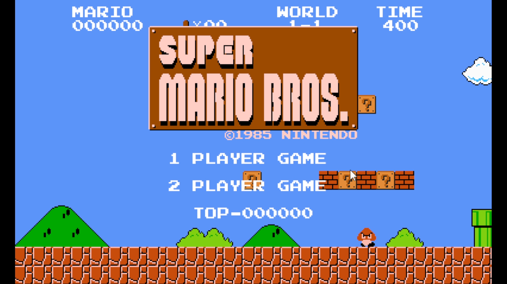
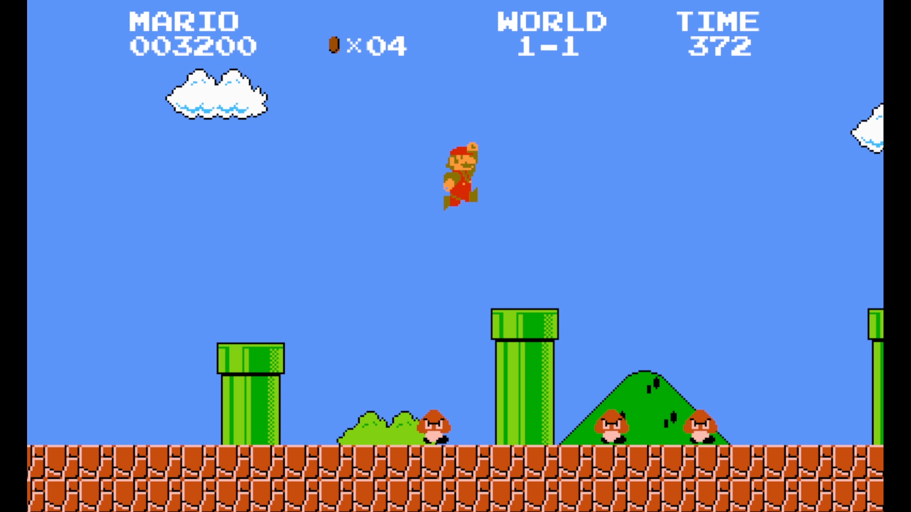
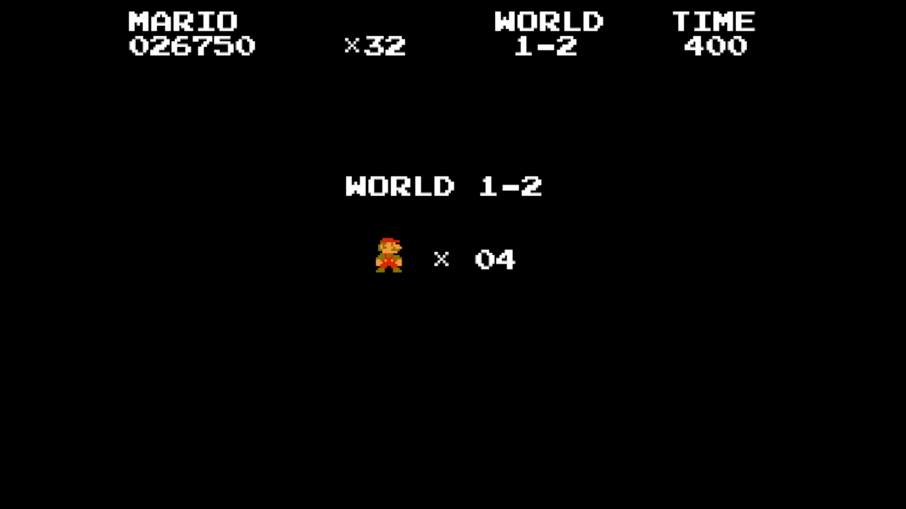

# 2026 OOPL Final Report

## 組別資訊

組別：T11
組員：113590023 黃柏瑋
復刻遊戲：超級瑪利歐兄弟 (Super mario bros.)

## 專案簡介

### 遊戲簡介
超級瑪利歐兄弟（Super Mario Bros.）是任天堂於1985年在NES（美版紅白機）推出的經典橫向捲軸動作遊戲。玩家操控水管工瑪利歐，突破障礙，拯救蘑菇王國的碧姬公主，奠定了現代平台跳躍遊戲的基礎。
遊戲機制：透過踩踏敵人頭部來擊敗對手，藉由精準的跳躍閃避深谷與機關。如果在終點跳得越高、抓住越高的旗桿，就能獲得越高的分數。
本遊戲中重現了物理跳躍手感、磚塊碰撞機制、敵人（如 Goomba、Koopa），以及多樣化的道具系統（如蘑菇、火焰花）。

### 組別分工
整組只有一個人應該就不用寫分工了吧。

## 遊戲介紹

### 遊戲規則
遊戲規則
- 移動與跳躍： 玩家透過鍵盤控制瑪利歐左右移動與跳躍，跳躍高度會受到按鍵時間長短及物理重力影響。

- 擊敗敵人： 透過踩踏敵人的頭部來擊敗它們（例如 Goomba），或者利用龜殼擊退其他敵人。若不慎從側面或下方碰觸到敵人，將會受到傷害。

- 物品收集： 關卡中散佈著金幣與問號磚塊。頂撞問號磚塊可獲得金幣或強化道具（如使瑪利歐變大的紅蘑菇、獲得發射火球能力的火之花）。

- 過關條件： 在限制時間內抵達關卡最右側，並跳上終點的旗桿即算過關。

### 遊戲畫面
- 標題畫面截圖

- 遊戲畫面截圖

- 關卡介面截圖


## 程式設計

### 程式架構
- 實作了多個單例或專屬管理器來統籌不同系統，例如負責特效播放與清除的 EffectManager、管理音效的 SFXManager，以及負責關卡載入與物件生成的 LevelManager。

- 組件與繼承： 所有的遊戲實體（瑪利歐、敵人、磚塊）皆繼承自底層的 Util::GameObject。透過多型（Polymorphism）實作不同敵人的 Update() 等行為。問號方塊、可破壞的磚塊則繼承了 Tile，方便管理與建立物件。
### 程式技術
- 使用智能指標來管理遊戲物件的生命週期，取代傳統指標，大幅降低 Memory Leak 的風險。
- 使用json存儲地圖資料，方便後續修改、建立新地圖。
- 使用狀態機管理角色、敵人的行為。
- 使用矩陣實現與地形的碰撞，降低運算步驟。
### 使用到 AI/AI Agent 的部分 (沒有用到者，不需要寫這篇)
- 使用AI修正一些BUG，如圖片放大時邊緣模糊的問題。

## 結語

### 問題與解決方法
此遊戲為2D像素遊戲，遊戲素材大部分都是16x16像素的圖片，我想讓遊戲畫面變大，所以使用了縮放的功能，但圖片放大之後變得很模糊。

詢問AI後才知道SDL2放大圖片時，會在像素之間做混色與漸變。導致素材變得很模糊。
```SDL_SetHint(SDL_HINT_RENDER_SCALE_QUALITY, "0");```<br>
使用這行程式碼調整SDL的設定後，就能夠正常縮放圖片素材了。
### 自評

| 項次 | 項目                   | 完成 |
|------|------------------------|-------|
| 1    | 這是範例 |  V  |
| 2    | 完成專案權限改為 public |  V  |
| 3    | 具有 debug mode 的功能  |  V  |
| 4    | 解決專案上所有 Memory Leak 的問題  |  V  |
| 5    | 報告中沒有任何錯字，以及沒有任何一項遺漏  |  V  |
| 6    | 報告至少保持基本的美感，人類可讀  |  V  |

### 心得
上學期的OOP教了許多的程式設計的技巧，而這次的OOPL則是藉由復刻遊戲來進行實際應用。

這種實際應用的方式，讓我能夠大幅度的提升OOP、C++的熟練度，且過程也非常的有趣，是一種很好的學習方式。

### 貢獻比例
- 113590023 黃柏瑋 : 100%